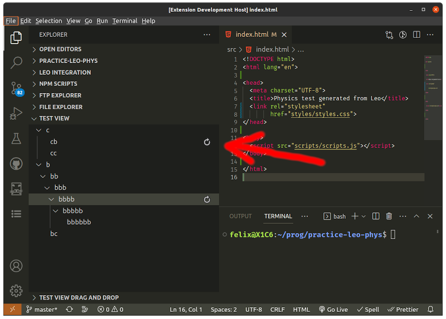
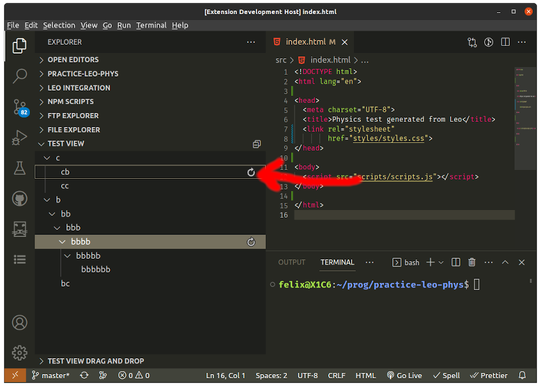

# Demo for reveal 'select/focus' option problem

## Description of the problem

When trying to update a treeview with a different tree structure, while preserving the focus in the vscode panel where it currently is, (for example, leaving the focus in an editor where the user is currently typing), it is possible to change the tree and set a node as the 'selected-node' without disturbing the focus placement with the 'reveal' method by setting it's option parameter to : `{select: true}`

 But this may leave the 'ghost' of the cursor-focus on a node at the same position as the last cursor-selection was placed. *see first screenshot below.*

The only way to remove the appearance of that 'ghost-cursor' is to use the treeview's reveal method with the 'focus' option set to true: `{select: true, focus: true}` **But that also changes the overall vscode's focus onto the treeview itself!** ...making it impossible to get rid of those artifacts (pointed by the red arrows in the screenshot below) without changing the focused panel of vscode.

## This sample extension illustrates the problem

This sample extension was branched off from the [vscode-extension-samples/tree-view-sample/](https://github.com/microsoft/vscode-extension-samples/tree/main/tree-view-sample)

This modified treeview sample extension tries to reveal and select the node in the tree that has a label of exactly 4 characters long. (arbitrary choice just to have one selected) And offers a command (CTRL+T) that changes the outline, along with the 'Id's of each nodes. The node with a label of 4 characters length is again revealed and selected.

### To reproduce the problem

1. Open the Test View and click on a node other than the selected one to set the 'cursor focus' on a new one, then either leave the focus in the tree, or place focus in an editor pane.

2. hit CTRL+T to change the tree and set the selection automatically. (you can hit CTRL+T repeatedly to change the tree again)

3. Notice the last 'cursor focus' position is still outlined (if focus still in tree) or that the 'ghost' of that 'cursor-focus' is still visible with the 'refresh' icon. (hovering over it will also **not** highlight it)

## With the user having the focus in the editor, pressing CTRL+T will **leave icons on an un-hoverable node**. (the one that had the focus outline)

## With the focus in the outline prior to pressing CTRL+T, the outline will be around the node which had focus. Even if the selection is changed with 'reveal'

## Proposed solution/feature

### In order to offer the possibility of revealing a node, and have it 'selected' while leaving the vscode's focus in its current pane (e.g. *to let a user continue to type in an editor*) AND without having the 'ghost' of the last focused node be apparent like in the screenshots above:

Could the 'reveal' method's option have another member called 'cursor', that when true, would set the 'focus-cursor' on the revealed node, without changing the overall focused panel of vscode?

 (the 'focus' member of the options should retain the same function it already has, not to break any existing extensions, by placing the 'focus-cursor' and the overall focus in the treeview that the 'reveal' method is called for.)
